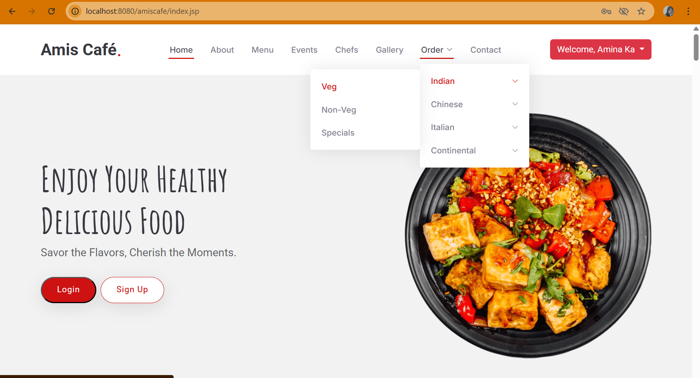
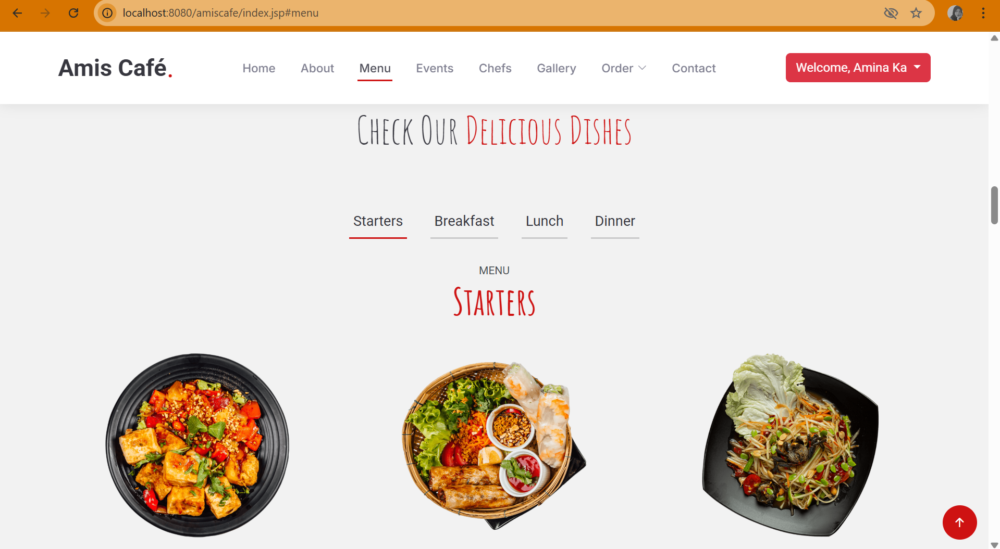
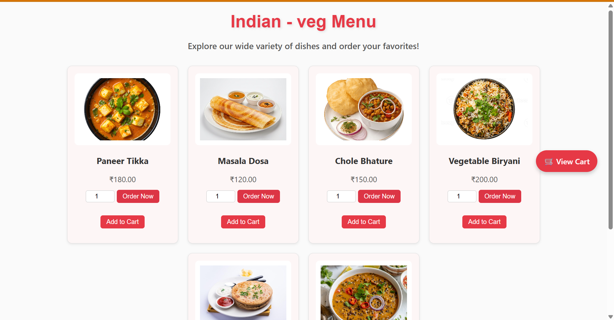
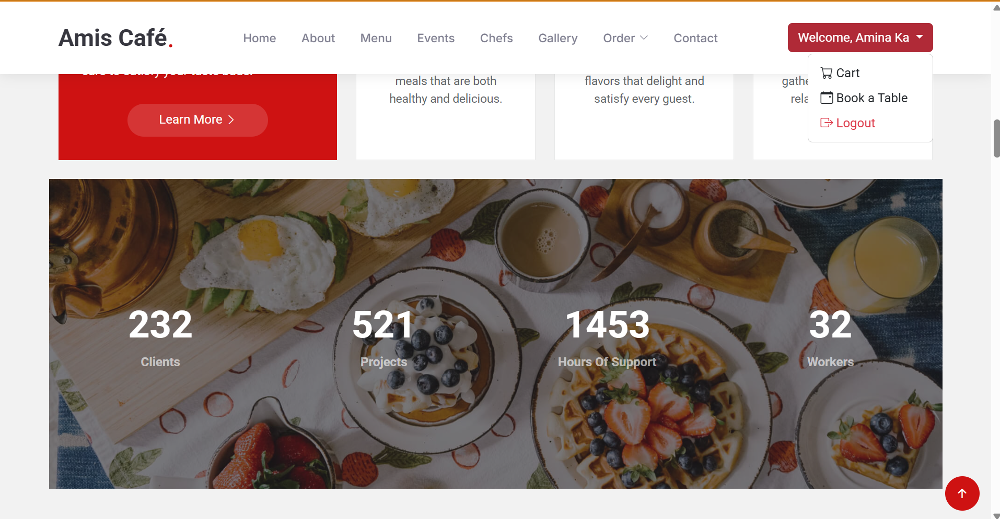
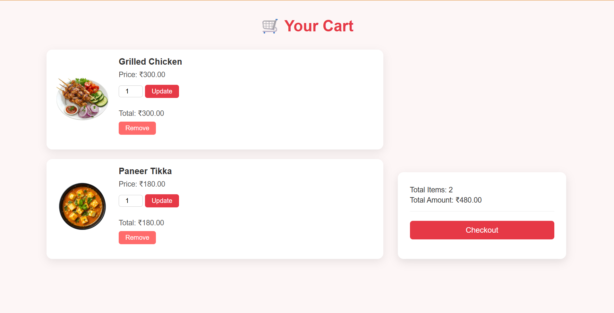
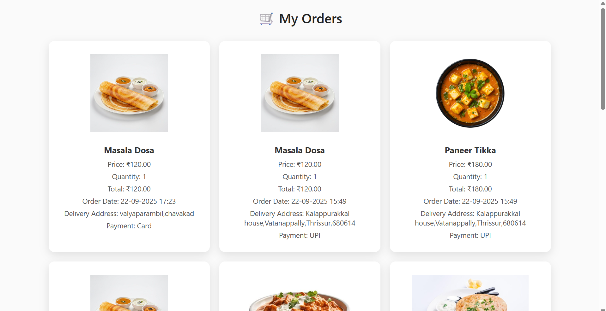
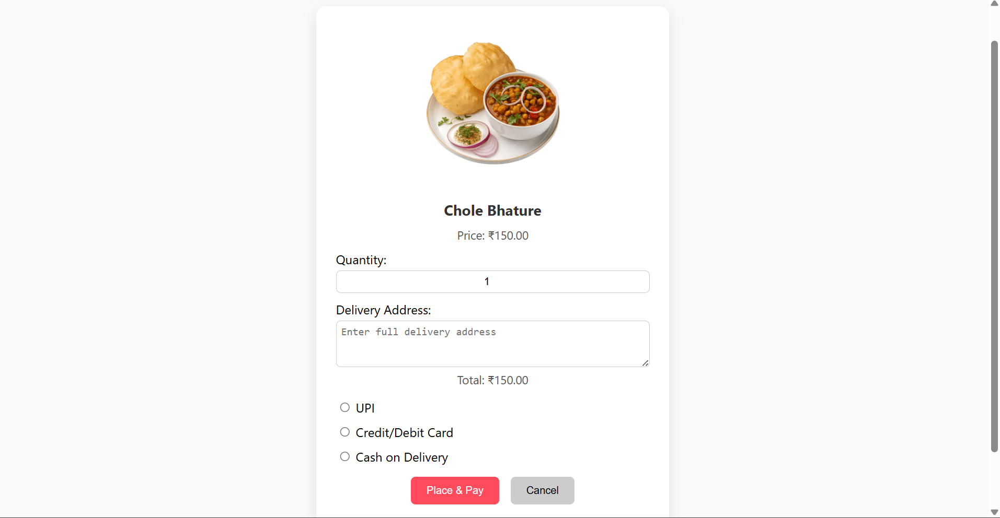
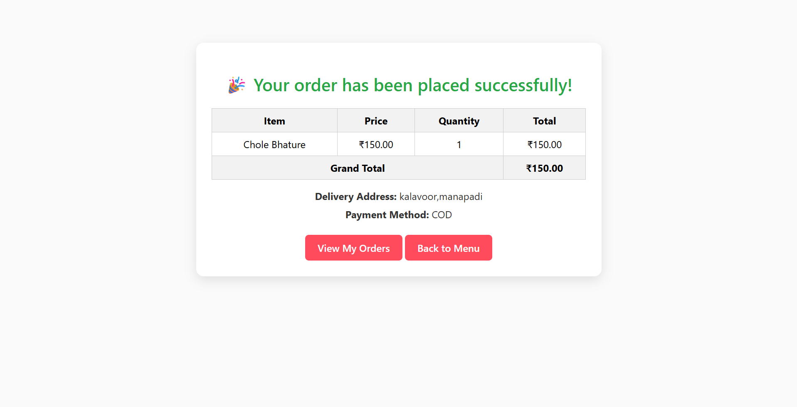
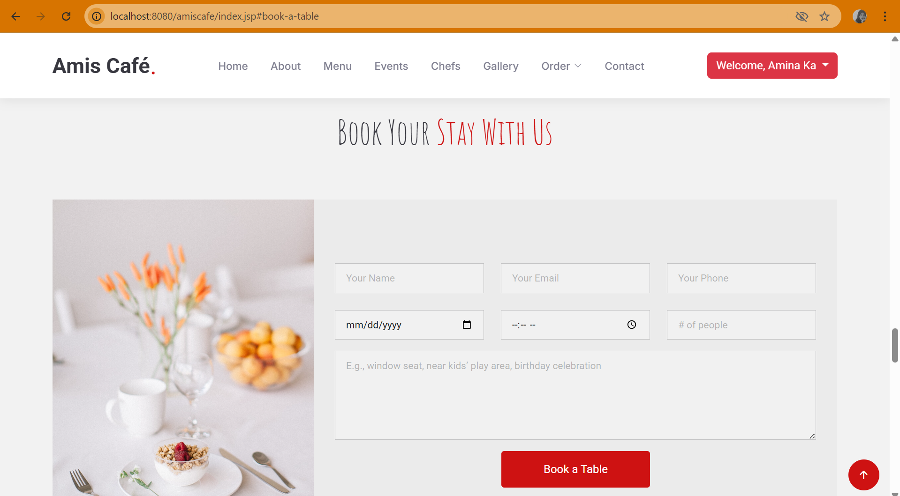

# Amis Café – Online Menu, Ordering & Table Booking System

A full-stack Java web application built using **Java (JSP & Servlets)**, **Hibernate ORM**, **MySQL**, and **CSS**, featuring menu management, online ordering, shopping cart, and table booking system.  

---

## Project Overview

Amis Café allows customers to:  
- Browse the menu by cuisine and type (veg, non-veg, specials)  
- Add items to the cart  
- Update quantities and remove items from the cart  
- Checkout orders with a simple and clean order summary  
- Book tables for dine-in with date, time, and number of seats  
- Access a responsive and visually appealing UI  

The system supports login functionality and basic error handling for orders and bookings.

---

## Features

### Menu & Ordering
- Responsive menu page with pastel-themed cards  
- Add to cart and update quantity functionality  
- Remove items from cart  
- View cart and checkout flow  
- Red-themed order buttons for high visibility  
- Graceful handling of empty carts  

### Table Booking
- Book a table with date, time, and number of seats  
- Prevent double-booking for the same time slot  
- View and manage bookings  

### Backend & Database
- Hibernate ORM for mapping Java entities to MySQL tables  
- Tables include `Users`, `MenuItems`, `Cart`, `Orders`, and `Bookings`  
- DAO layer for database operations  
- Service layer for business logic  

---

## Screenshots

**Menu Page:**   
  
  
   

**Cart Page & Order:**  
  
  
  

**Checkout Flow & Payment:**  
  
  

**Table Booking Page:**  
  

---

## Setup Instructions

1. Clone the repository  
```bash
git clone <your-repo-url>
```
2.Import project into your IDE (Eclipse, IntelliJ, etc.)

3.Configure MySQL database

4.Create a database named amis_cafe

5.Update hibernate.cfg.xml with your DB credentials

6.Build & Run

7.Deploy on Apache Tomcat server

8.Access the app via http://localhost:8080/AmisCafe

Login / Sign up
Default admin credentials: (if any)
Register as a customer to place orders or book tables
